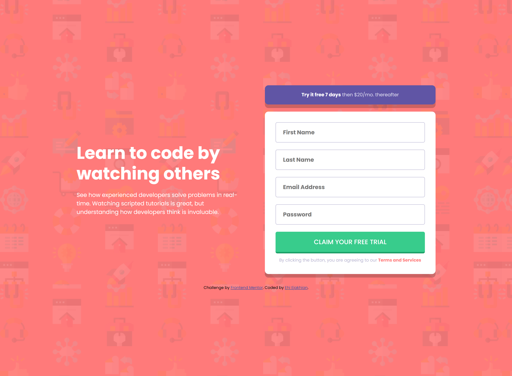
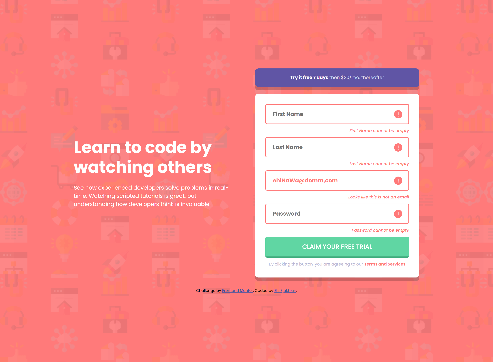
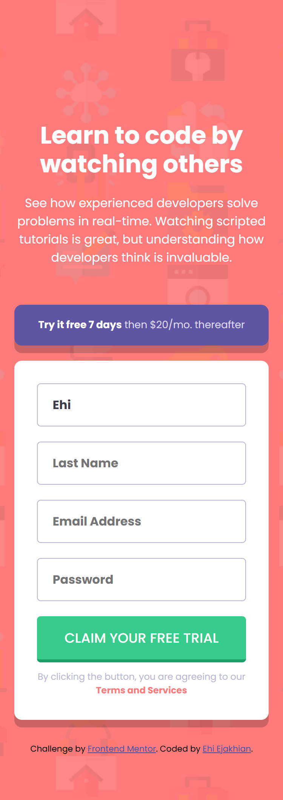

# Frontend Mentor - Intro component with sign up form solution

This is a solution to the [Intro component with sign up form challenge on Frontend Mentor](https://www.frontendmentor.io/challenges/intro-component-with-signup-form-5cf91bd49edda32581d28fd1). Frontend Mentor challenges help you improve your coding skills by building realistic projects. 

## Table of contents

- [Me](#meet-me)
- [Screenshot](#screenshot)
- [My process](#my-process)
  - [Built with](#built-with)
  - [What I learned](#what-i-learned)
  - [Continued development](#continued-development)
  - [Useful resources](#useful-resources)
- [Acknowledgments](#acknowledgments)
- [Author](#author)
- [Thanks](#thanks)


## Meet Me
Good day. I'm Ehi. I'm an aspiring developer from Edo, Nigeria. I took this challenge. Here's how I did it and thanks for reading!

## Screenshot
My Desktop Build

My Desktop Build -Error states

My Mobile Build


## My process
After my HTML, I start styling with padding. I set the margin of all elements to zero and then give all elements borders. This helps me visualize all element boundaries - all this I do without adding any color.

Then, I add color, backgrounds and border radii to the assigned elements. I prefer using Comic Sans MS as my font because it feels relaxing to my eyes and it helps me think better. I can't explain it though, it's just a feeling.

Funny and weird, right?😁

### Built with

- Semantic HTML5 markup
- CSS custom properties
- Flexbox
- SCSS
### What I learned

I'm really proud of this code.

```scss
.first-name, .last-name, .email, .password {
@include display-flex(space-between, flex-end, column, 10px);

.input-and-span {
  @include display-flex(none, center, row, 0px);
  width: 100%;
  position: relative;

  input {
    color: $Dark-Blue;
    border-radius: 5px;
    border: 1px solid $Grayish-Blue;
    font-weight: 700;
    width: 100%;
    padding: 15px 60px 15px 20px;
    font-size: 1rem;
    caret-color: $Blue;

    &:focus {
      outline: none;
      border: 2px solid $Blue;
    }

  }
  .focused {
    color: $Red;
    border: 2px solid $Red;
    & + img {
      display: flex;
    }
  }

  >img {
    display: none;
    position: absolute;
    right: 20px;
  }
}
```

and I also had co-pilot give me a function for email validation

```js
function isValidEmail(email) {
  const re = /^[^\s@]+@[^\s@]+\.[^\s@]+$/;
  return re.test(String(email).toLowerCase());
}
```

It was really fun!

## Author
For now I don't have a website of my own, but I am working on having one soon. I'll also need all the help I can get on this one. It's very important.
- Frontend Mentor - [@EhiEjakhian](https://www.frontendmentor.io/profile/EhiEjakhian)
- Chat me on Whatsapp - [Ehi Ejakhian](https://wa.me/+2348142340182?text=Hello%20Ehi%20.%20I%20checked%20your%20Intro%20Component%20With%20Sign%20up%20Form%20solution)
- LinkedIn - [Ejakhian Ehi](https://ng.linkedin.com/in/ehi-ejakhian-2302a7318)

I'm also an aspiring comic and sketch artist, so if you have any gigs or if you can relate, check me up on whatsapp and see my art.

# Thanks!
Thank you for going through this. I really hope I did good to your taste, if not please tell me how to improve on the comments section of my solution. Thanks again!
